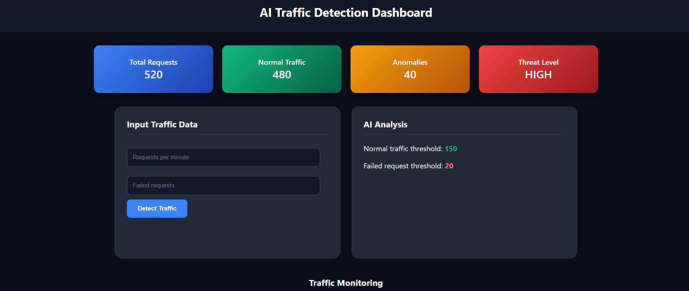
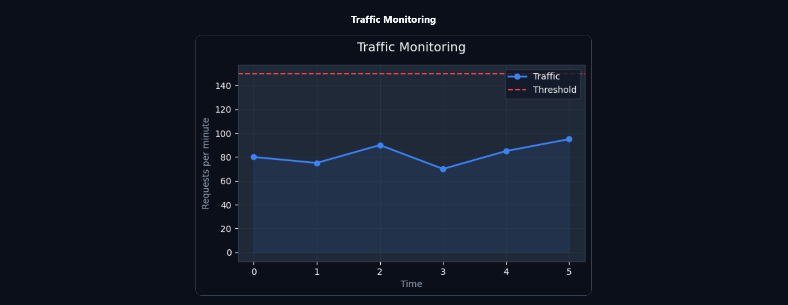

🚦 AI Traffic Detector

AI-Based Network Traffic Anomaly Detection System using Machine Learning, Flask, and AWS EC2

---

🚀 Project Overview

This project detects abnormal network traffic patterns that may indicate cyber threats such as DDoS attacks.

The system analyzes network traffic data using a Machine Learning model (Isolation Forest) and displays the results through a web-based monitoring dashboard.

---

🎥 Demo Video

[▶ Download Demo Video](demo-video.mp4)

---

📸 Project Screenshots

### Login Page

### Monitoring Dashboard

### Traffic Graph

### Traffic Data Table

---

⚙️ Tech Stack

Frontend

HTML
CSS

Backend

Python
Flask

Machine Learning

Isolation Forest Algorithm

Cloud Platform

AWS EC2

---

⚙️ How It Works

1️⃣ The user logs into the system through the login page.

2️⃣ The user enters network traffic values such as:

- Requests per minute
- Failed requests

3️⃣ The Flask backend receives the input data.

4️⃣ The data is sent to the Machine Learning model (Isolation Forest).

5️⃣ The model analyzes the traffic pattern and determines whether the traffic is Normal or Anomalous.

6️⃣ The result is displayed on the monitoring dashboard.

7️⃣ The system also generates:

- Traffic graphs
- Traffic data tables
- IP location information

---

🧠 Machine Learning Model

Algorithm Used:
Isolation Forest

Purpose:
Detect abnormal network behavior based on traffic patterns.

---

👨‍💻 Team

BCA Academic Project — Izee Business School

| Name | Role |
|------|------|
| Anjana Janardhanan | Project Developer |
| Adithya | Project presentation and documentation support |
| Greeshma | Project presentation and documentation support |

---

☁️ Deployment

The application is deployed on AWS EC2, allowing the system to run as a cloud-based monitoring dashboard.

---

📜 License

This project is developed for educational purposes.

---

⭐ Built using Python, Machine Learning, and AWS
